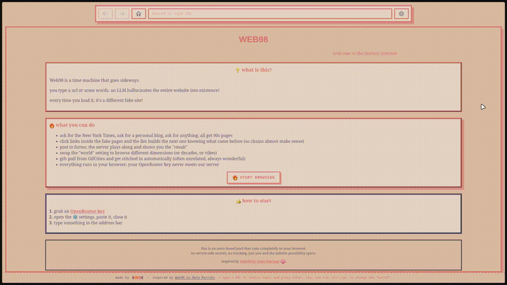

# web98



<p align="center"> it works like any other browser: type a URL or a search query, and it <strong>loads a page!</strong> </p>

this is an Astro-based reimplementation of the [Web98](https://github.com/nate-parrott/web98) “fantasy internet simulator,” built to run on the web and use OpenRouter as the LLM provider.

### test the demo here
https://web98.koik.com.br

it works like any other browser: type a URL or a search query, and it loads a page!

but in this case, the page isn’t coming from the internet. it’s coming from chatGPT. 

the core experience matches the original app:
- a “browser” UI with an address bar.
- type a URL or search query to “navigate.”
- the page HTML is generated by an LLM that roleplays an alternate world (default: 1996 retro web).
- search suggestions are also generated by the LLM.

new features I thought it was worth implementing:

- chain-linking: click links inside the fake pages and the LLM builds the next one knowing what came before (so chains almost make sense)
- instead of using a small set of GIFs, i've added an API that fetches from GifCities and get stitched in automatically (often unrelated, always wonderful)
- also a small set of pixelated emojis that fit into the vibe (provided by Fava Beans' [Free Pixel Art Emoji Pack](https://fava-beans.itch.io/free-pixel-art-emoji-pack))

this port runs fully in the browser. users provide their OpenRouter API key in the Settings modal, and it's saved on your local storage, so no server-side OpenRouter secrets are used.


## quick start

prerequisites:
- Node.js 18.14+ (recommended LTS)
- an OpenRouter API key (https://openrouter.ai) — entered in the browser (Settings), not in .env

install and run:
```bash
cd port
npm install
cp .env.example .env  # optional (site metadata / dev server), no API key here
npm run dev
```

open your browser at the URL shown in the terminal (typically http://localhost:3000).

build for production:
```bash
npm run build
npm run preview   # or run the SSR entry directly (below)
# SSR (Node adapter) entry:
node ./dist/server/entry.mjs
```

environment (.env) keys are entirely optional:
- OPENROUTER_API_BASE: Optional. Default https://openrouter.ai/api/v1
- OPENROUTER_MODEL: Optional. Default moonshotai/kimi-k2-0905
- OPENROUTER_SITE_URL: Optional. Used for meta/canonical (and can be forwarded as headers client-side if desired)
- OPENROUTER_APP_NAME: Optional. Used for meta/canonical (and can be forwarded as headers client-side if desired)
- HOST / PORT: Optional. Dev server host/port. Example: HOST=0.0.0.0, PORT=4321

do not place your OpenRouter API key in .env. enter it in the app’s Settings modal.
